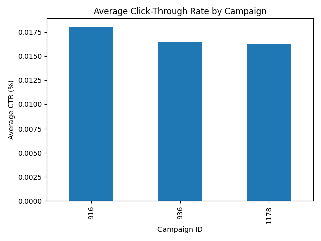
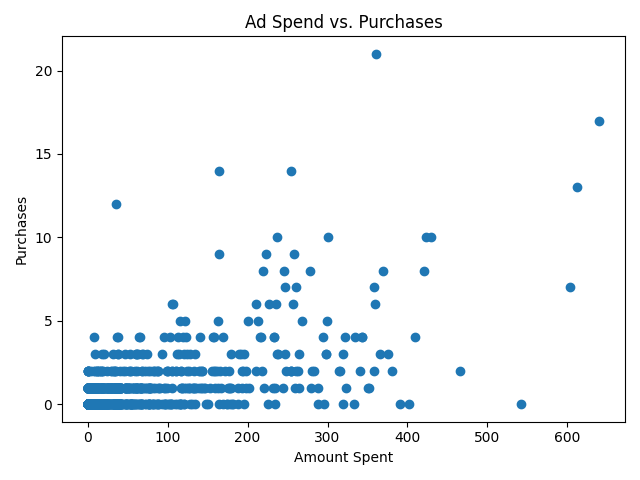

# campaign-insights

A Python package that analyses Facebook ad campaign data and turns it into
clear, actionable budget recommendations.

Given a CSV of ad-level results, it calculates key marketing KPIs per
campaign (CTR, conversion rate, CPA, ROAS), flags campaigns that lose money
or have too little data to be trusted, suggests where to shift budget, and
saves comparison charts.

## Installation

Requires Python 3.10 or newer and [uv](https://docs.astral.sh/uv/).

```bash
git clone https://github.com/mina-motaghinasab/campaign-insights.git
cd campaign-insights
uv sync
```

## Usage

### Command line

```bash
uv run -m campaign_insights data/facebook_ads.csv
```

Options:

| Option | Default | Description |
|---|---|---|
| `--order-value` | `50` | Average revenue of one purchase (the dataset has no revenue column) |
| `--output-dir` | `outputs` | Folder where the charts are saved |

Example with a different order value:

```bash
uv run -m campaign_insights data/facebook_ads.csv --order-value 70
```

### Example output

```
Campaign summary
----------------------------------------
Campaign 916: CTR=0.02%, Conversion Rate=21.24%, CPA=6.24
Campaign 936: CTR=0.02%, Conversion Rate=9.22%, CPA=15.81
Campaign 1178: CTR=0.02%, Conversion Rate=2.42%, CPA=63.83

Recommendations (order value: 50.00)
----------------------------------------
- Campaign 916 is profitable (ROAS 8.02).
- Campaign 916 has only 54 ads, so its results are less reliable.
- Campaign 936 is profitable (ROAS 3.16).
- Campaign 1178 loses money (ROAS 0.78). Consider pausing it or improving its targeting.
- Shift budget from Campaign 1178 to Campaign 936.

Charts saved to outputs/
```

### As a library

```python
import campaign_insights as ci

df = ci.load_campaign_data("data/facebook_ads.csv")
totals = ci.summarize_by_campaign(df)
campaigns = ci.build_campaigns(totals)

for campaign in campaigns:
    print(campaign.summary())
```

## Charts

**Average click-through rate by campaign**



**Ad spend vs. purchases** (one point per ad)



## Key findings

- Campaign 1178 received about 95% of the total budget but has by far the
  highest cost per purchase (about 64, compared with about 16 for
  campaign 936). At an order value of 50 it loses money.
- Campaign 936 is the best-performing campaign with enough data to be
  trusted.
- Campaign 916 looks the most efficient, but with only 54 ads its results
  are not reliable enough to base budget decisions on.
- Whether a campaign is profitable depends strongly on the assumed order
  value: at 70, campaign 1178 becomes profitable.

## KPIs

| KPI | Formula |
|---|---|
| CTR | clicks / impressions × 100 |
| Conversion rate | purchases / clicks × 100 |
| CPA (cost per acquisition) | spent / purchases |
| ROAS (return on ad spend) | revenue / spent, where revenue = purchases × order value |

KPIs are calculated per campaign from the summed totals, not averaged per
ad. In this dataset some ads have more conversions than clicks (people who
saw the ad and bought later without clicking), so per-ad conversion rates
can exceed 100% and would be misleading.

## Project structure

```
campaign-insights/
├── data/facebook_ads.csv        # dataset
├── outputs/                     # saved charts
├── src/campaign_insights/
│   ├── __init__.py              # public functions and classes
│   ├── __main__.py              # command-line interface
│   ├── loader.py                # read and validate the CSV
│   ├── metrics.py               # KPI functions
│   ├── campaigns.py             # Campaign classes (inheritance)
│   ├── analysis.py              # summary and recommendations
│   └── plotting.py              # charts
└── pyproject.toml
```

## Data source

"Sales Conversion Optimization" dataset by GOKAGGLERS on Kaggle:
https://www.kaggle.com/datasets/loveall/clicks-conversion-tracking

Data from an anonymous organisation's Facebook ad campaigns (1,143 ads,
3 campaigns). Included here for educational purposes. The original file used
old Mac (CR) line endings, which were converted to standard (LF) line endings.

## Use of AI tools

I used Claude (an AI assistant) to explain concepts, suggest code and review
my work during development. I typed, ran and tested all code myself.

## Author

Mina Mottaghinasab — final project for *Introduction to Python*,
TU Dortmund, 2026.