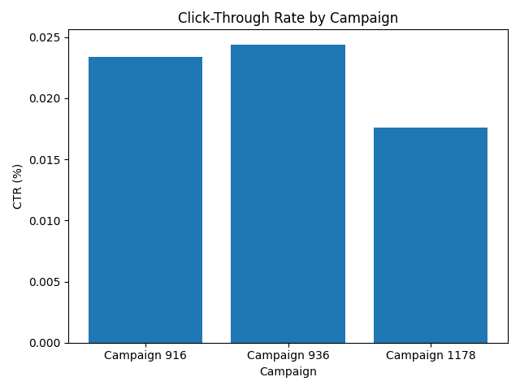
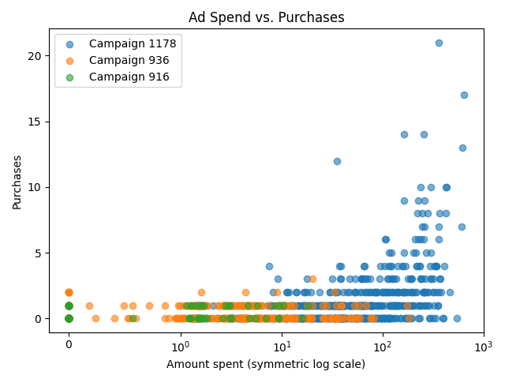

# campaign-insights

A Python package that analyses Facebook ad campaign data and turns it into
clear, cautious budget recommendations.

Given a CSV (comma-separated values) file of ad-level results, it calculates
key performance indicators (KPIs) per campaign: click-through rate (CTR),
purchases per 100 clicks, approval rate, cost per acquisition (CPA) and
return on ad spend (ROAS). It flags campaigns that lose money or have too
little data to be trusted, compares small campaigns using a confidence
interval (CI), suggests where to test a budget shift, and saves comparison
charts.

## Installation

Requires Python 3.10 or newer and [uv](https://docs.astral.sh/uv/).

```bash
git clone https://github.com/mina-motaghinasab/campaign-insights.git
cd campaign-insights
uv sync
```

## Usage

### Command line

```bash
uv run -m campaign_insights data/facebook_ads.csv
```

or, using the installed console script:

```bash
uv run campaign-insights data/facebook_ads.csv
```

Options:

| Option | Default | Description |
|---|---|---|
| `--order-value` | `50` | Average revenue of one purchase, must be greater than 0 (the dataset has no revenue column) |
| `--output-dir` | `outputs` | Folder where the charts are saved (created if missing) |

On invalid input (missing file, missing columns, negative or non-numeric
values) the tool prints an error to the standard error stream (stderr) and
exits with code 1.

### Example output

```
Campaign summary
----------------------------------------
Campaign 916: CTR=0.0234%, Purchases per 100 clicks=21.24, Approval rate=41.38% (95% CI 29.63-54.20%), CPA=6.24
Campaign 936: CTR=0.0244%, Purchases per 100 clicks=9.22, Approval rate=34.08% (95% CI 30.20-38.19%), CPA=15.81
Campaign 1178: CTR=0.0176%, Purchases per 100 clicks=2.42, Approval rate=32.67% (95% CI 30.92-34.47%), CPA=63.83
Money values are in the dataset's currency, which is not specified.

Recommendations (order value: 50.00)
----------------------------------------
- Campaign 916 is profitable (ROAS 8.02).
- Campaign 916 has only 24 purchases, so its results are not reliable.
- Campaign 936 is profitable (ROAS 3.16).
- Campaign 1178 loses money (ROAS 0.78). Consider pausing it or improving its targeting.
- Campaign 916's approval rate (95% CI 29.63-54.20%) overlaps with Campaign 936's (30.20-38.19%), so there is no clear difference.
- Test moving part of Campaign 1178's budget to Campaign 936. Campaign 936 spent much less, so its CPA may not hold at a larger budget.

Charts saved to outputs/
```

### As a library

```python
import campaign_insights as ci

df = ci.load_campaign_data("data/facebook_ads.csv")
campaigns = ci.build_campaigns(ci.summarize_by_campaign(df))

for campaign in campaigns:
    print(campaign.summary())

for message in ci.recommend(campaigns, order_value=50):
    print(message)

ci.plot_ctr_by_campaign(campaigns, "outputs/ctr_by_campaign.png")
```

## Charts

**Click-through rate by campaign** (from summed clicks and impressions,
the same numbers as the printed summary)



**Ad spend vs. purchases** (one point per ad, coloured by campaign; the
x-axis uses a symmetric log scale so that ads with zero spend stay visible)



## Key findings

- Campaign 1178 received about 95% of the total budget but has by far the
  highest cost per purchase (about 64, compared with about 16 for campaign
  936). At an order value of 50 it loses money.
- Campaign 936 has the highest click-through rate and is the
  best-performing campaign with enough data to be trusted.
- Campaign 916 looks the most efficient, but it has only 24 purchases. Its
  approval rate's confidence interval overlaps with campaign 936's, so
  there is no clear evidence that it performs better.
- The budget recommendation is deliberately cautious: campaign 936 spent
  about 2.9k compared with 1178's 55.7k, and there is no evidence that it
  would keep its CPA with a much larger budget.
- Profitability depends strongly on the assumed order value: at 70, every
  campaign is profitable and no budget shift is suggested.

## KPIs

| KPI | Formula |
|---|---|
| CTR | clicks / impressions × 100 |
| Purchases per 100 clicks | purchases / clicks × 100 |
| Approval rate | purchases / enquiries × 100 |
| CPA | spent / purchases |
| ROAS | revenue / spent, where revenue = purchases × order value |

All KPIs are calculated per campaign from summed totals, not averaged per
ad, so that large and small ads are weighted correctly.

A KPI that cannot be calculated (for example a CPA with zero purchases, or
a ROAS with zero spend) is shown as `n/a` instead of `0.00`, so that
missing data is never mistaken for the best possible value.

**Why "purchases per 100 clicks" and not "conversion rate":** some
purchases come from people who saw an ad without clicking. In this dataset
72 ads have more purchases than clicks and 207 ads have no clicks at all.
The number is therefore not a share of clicks, and the name avoids
suggesting that it is.

**Reliability:** a campaign with fewer than 30 purchases is flagged as not
reliable. Such a campaign is compared with the best reliable campaign using
a 95% [Wilson confidence interval](https://en.wikipedia.org/wiki/Binomial_proportion_confidence_interval#Wilson_score_interval)
on the approval rate. The interval is calculated on the approval rate
because it is a true proportion: purchases never exceed enquiries, whereas
purchases can exceed clicks.

## Testing and code quality

```bash
uv run pytest          # 19 tests for metrics, recommendations and loader
uv run ruff check .    # linting
uv run ruff format .   # formatting
```

## Project structure

```
campaign-insights/
├── data/facebook_ads.csv        # dataset
├── outputs/                     # saved charts
├── src/campaign_insights/
│   ├── __init__.py              # public functions and classes
│   ├── __main__.py              # command-line interface
│   ├── loader.py                # read and validate the CSV
│   ├── metrics.py               # KPI functions and Wilson interval
│   ├── campaigns.py             # Campaign classes (inheritance)
│   ├── analysis.py              # summary and recommendations
│   └── plotting.py              # charts
├── tests/                       # pytest tests
└── pyproject.toml
```

`OrganicCampaign` is not used with this dataset, which contains only paid
campaigns. It is included to show how the `Campaign` base class can be
extended.

## Data source

"Sales Conversion Optimization" dataset by GOKAGGLERS on Kaggle:
https://www.kaggle.com/datasets/loveall/clicks-conversion-tracking

Data from an anonymous organisation's Facebook ad campaigns (1,143 ads,
3 campaigns). Included here for educational purposes. The original file used
old Mac line endings (carriage return, CR), which were converted to standard
line endings (line feed, LF). The currency of the spend values is not
specified in the dataset.

## Use of AI tools

I used Claude (an AI assistant) as a coding aid: to explain concepts,
suggest code and help fix errors. I chose the project topic and dataset,
typed, ran and tested all code myself, and revised the analysis based on
feedback. I can explain every part of the code.

## Author

Mina Motaghinasab — final project for *Introduction to Python*,
TU Dortmund, 2026.
